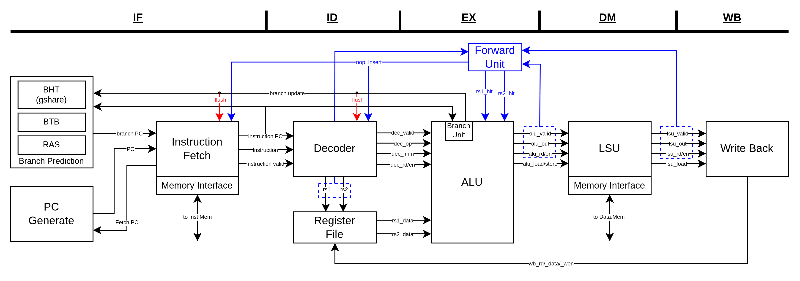

# RISC-V

---
### File Arch.
  ```
  RTL : Source code of rv32i_core.
  SIM : Simulation environment (sim/debug).
  testbench : Assembly code pattern / SystemVerilog bench.
  ```

### How to run simulation
  ```
  cd ./SIM/
  ./run_vcs hello
  ```
### How to open verdi
  ```
  cd ./SIM/
  ./run_verdi
  ``` 
### Todo List
- [x] Architecture Diagram
- [x] LSU re-design. 
- [ ] RAS verification.
- [ ] Control and Status Register (CSR)
- [ ] Memory Access Mechanism Optimized
- [ ] BUS Interface
- [ ] Interrupt
- [ ] L1 I-Cache
- [ ] L1 D-Cache